# Database Architecture Specification

This document details the production-grade database architecture designed for **Suyash Pride Housing Society Ltd.**. The database is built on **Supabase PostgreSQL**, utilizing custom index structures, Row Level Security (RLS) filters, and soft-delete schemas. It is optimized for current capacity (137 properties) and scales seamlessly to support 500+ units, multiple societies, and 10,000+ users.

## 1. Entity Relationship Diagram (ERD)

```mermaid
erDiagram
    SOCIETIES ||--o{ WINGS : "contains"
    SOCIETIES ||--o{ PROPERTIES : "has"
    WINGS ||--o{ PROPERTIES : "houses"
    
    USERS ||--o{ PROPERTY_OWNERS : "owns"
    PROPERTIES ||--o{ PROPERTY_OWNERS : "owned_by"
    
    USERS ||--o{ TENANTS : "rents"
    PROPERTIES ||--o{ TENANTS : "rented_by"
    
    PROPERTIES ||--o{ FAMILY_MEMBERS : "resides"
    PROPERTIES ||--o{ VEHICLES : "parks"
    PROPERTIES ||--o{ PARKING_SLOTS : "allocates"
    
    USERS ||--o{ NOTICES : "publishes"
    
    DOCUMENT_CATEGORIES ||--o{ DOCUMENTS : "categorizes"
    USERS ||--o{ DOCUMENTS : "uploads"
    DOCUMENTS ||--o{ CHATBOT_DOCUMENTS : "indexes"
    
    USERS ||--o{ EVENTS : "organizes"
    EVENTS ||--o{ EVENT_REGISTRATIONS : "schedules"
    USERS ||--o{ EVENT_REGISTRATIONS : "joins"
    
    PROPERTIES ||--o{ COMPLAINTS : "references"
    USERS ||--o{ COMPLAINTS : "files"
    COMPLAINTS ||--o{ COMPLAINT_COMMENTS : "has"
    USERS ||--o{ COMPLAINT_COMMENTS : "comments"
    
    PROPERTIES ||--o{ MAINTENANCE_BILLS : "charges"
    MAINTENANCE_BILLS ||--o{ MAINTENANCE_RECEIPTS : "receipts"
    
    PROPERTIES ||--o{ PAYMENTS : "made_for"
    USERS ||--o{ PAYMENTS : "initiates"
    
    PROPERTIES ||--o{ VISITORS : "visits"
    
    GALLERY_ALBUMS ||--o{ GALLERY_IMAGES : "contains"
    USERS ||--o{ GALLERY_IMAGES : "uploads"
    
    USERS ||--o{ AUDIT_LOGS : "logs"

    SOCIETIES {
        uuid id PK
        varchar name
        varchar registration_number
        text address
        varchar city
        varchar state
        varchar pincode
        numeric latitude
        numeric longitude
        varchar email
        varchar phone
        varchar website
        timestamp created_at
        timestamp updated_at
    }

    WINGS {
        uuid id PK
        uuid society_id FK
        varchar wing_name
        text description
        timestamp created_at
    }

    PROPERTIES {
        uuid id PK
        uuid society_id FK
        uuid wing_id FK
        varchar unit_number
        varchar unit_type
        integer floor_number
        numeric area_sqft
        varchar ownership_status
        varchar status
        timestamp created_at
    }

    USERS {
        uuid id PK
        uuid auth_user_id FK
        varchar first_name
        varchar last_name
        varchar email
        varchar phone
        varchar profile_image
        varchar status
        timestamp created_at
    }

    PROPERTY_OWNERS {
        uuid id PK
        uuid property_id FK
        uuid user_id FK
        numeric ownership_percentage
        boolean is_primary_owner
        timestamp created_at
    }

    TENANTS {
        uuid id PK
        uuid property_id FK
        uuid user_id FK
        date lease_start
        date lease_end
        boolean is_active
        timestamp created_at
    }

    FAMILY_MEMBERS {
        uuid id PK
        uuid property_id FK
        uuid owner_id FK
        varchar name
        varchar relation
        varchar phone
        timestamp created_at
    }

    VEHICLES {
        uuid id PK
        uuid property_id FK
        uuid owner_id FK
        varchar vehicle_number
        varchar vehicle_type
        varchar parking_slot
        timestamp created_at
    }

    PARKING_SLOTS {
        uuid id PK
        varchar slot_number
        varchar slot_type
        uuid property_id FK
        varchar status
        timestamp created_at
    }

    NOTICES {
        uuid id PK
        varchar title
        text content
        varchar category
        varchar attachment_url
        uuid published_by FK
        timestamp published_at
        varchar status
        timestamp created_at
    }

    DOCUMENT_CATEGORIES {
        uuid id PK
        varchar name
        text description
    }

    DOCUMENTS {
        uuid id PK
        uuid category_id FK
        varchar title
        text description
        varchar file_url
        uuid uploaded_by FK
        timestamp created_at
    }

    EVENTS {
        uuid id PK
        varchar title
        text description
        timestamp event_date
        varchar event_location
        varchar cover_image
        varchar status
        uuid created_by FK
        timestamp created_at
    }

    EVENT_REGISTRATIONS {
        uuid id PK
        uuid event_id FK
        uuid user_id FK
        timestamp registered_at
    }

    COMPLAINTS {
        uuid id PK
        uuid property_id FK
        uuid user_id FK
        varchar category
        varchar subject
        text description
        varchar status
        varchar priority
        uuid assigned_to FK
        timestamp created_at
        timestamp updated_at
    }

    COMPLAINT_COMMENTS {
        uuid id PK
        uuid complaint_id FK
        uuid user_id FK
        text comment
        timestamp created_at
    }

    MAINTENANCE_BILLS {
        uuid id PK
        uuid property_id FK
        varchar billing_month
        integer billing_year
        numeric amount
        date due_date
        varchar status
        timestamp generated_at
    }

    MAINTENANCE_RECEIPTS {
        uuid id PK
        uuid bill_id FK
        varchar receipt_number
        numeric amount_paid
        timestamp paid_at
        varchar payment_method
    }

    PAYMENTS {
        uuid id PK
        uuid property_id FK
        uuid user_id FK
        numeric amount
        varchar purpose
        varchar razorpay_order_id
        varchar razorpay_payment_id
        varchar status
        timestamp paid_at
        timestamp created_at
    }

    VISITORS {
        uuid id PK
        uuid property_id FK
        varchar visitor_name
        varchar phone
        varchar vehicle_number
        timestamp expected_time
        varchar status
        timestamp created_at
    }

    STAFF {
        uuid id PK
        varchar name
        varchar designation
        varchar phone
        date joining_date
        varchar status
    }

    VENDORS {
        uuid id PK
        varchar name
        varchar service_type
        varchar contact_person
        varchar phone
        varchar email
        varchar status
    }

    GALLERY_ALBUMS {
        uuid id PK
        varchar name
        text description
        timestamp created_at
    }

    GALLERY_IMAGES {
        uuid id PK
        uuid album_id FK
        varchar image_url
        uuid uploaded_by FK
        timestamp created_at
    }

    CHATBOT_DOCUMENTS {
        uuid id PK
        uuid document_id FK
        varchar embedding_status
        timestamp last_indexed_at
    }

    AUDIT_LOGS {
        uuid id PK
        uuid user_id FK
        varchar action
        varchar entity_type
        uuid entity_id
        jsonb metadata
        timestamp created_at
    }
```



---

## 2. Table Schemas, Constraints & Triggers

- **Primary Keys**: Every table utilizes `UUID` generated via `gen_random_uuid()` to prevent ID predictability and ease multi-tenant database merges.
- **Auditing Timestamps**: Database-level triggers automatically update `updated_at` timestamps on tables like `societies`, `properties`, and `complaints` when edits occur.
- **Cascading Constraints**: `ON DELETE CASCADE` is set on linking tables (like `event_registrations`, `property_owners`, `tenants`) to prevent orphan metadata if properties or events are purged.
- **Data Validation Integrity Checks**:
  - Positive checks on financial fields (`amount >= 0`, `ownership_percentage BETWEEN 0 AND 100`).
  - Valid string enums on fields (e.g. `vehicle_type` in `'Car', 'Bike', 'EV', 'Commercial'`).

---

## 3. Indexing & Optimization Strategy

To ensure queries execute below 20ms under high load (10,000+ users), we deploy specialized indexing rules:

1. **Foreign Key Indexes**:
   - Explicit `B-Tree` indexes on foreign keys (e.g. `properties(society_id)`, `wings(society_id)`, `complaints(property_id)`) to speed up join queries.
2. **Partial Indexes**:
   - `CREATE INDEX idx_tenants_active ON tenants(property_id) WHERE is_active = true;` -> Speeds up lookup of currently active leases.
   - `CREATE INDEX idx_bills_unpaid ON maintenance_bills(property_id) WHERE status = 'Unpaid';` -> Accelerates dashboard loading for unpaid dues.
3. **Compound Indexes**:
   - `CREATE INDEX idx_bills_month_year ON maintenance_bills(billing_year, billing_month);` -> Optimizes multi-bill queries.

---

## 4. Row Level Security (RLS) Model

Supabase secures PostgreSQL tables using Row Level Security (RLS). Below is the access matrix mapped to database roles:

| Table Name | Public | Resident | Tenant | Shop Owner | Committee | Society Manager | Super Admin |
| :--- | :---: | :---: | :---: | :---: | :---: | :---: | :---: |
| `societies` | Read | Read | Read | Read | Read | Edit | Edit |
| `properties` | None | Read Self | Read Self | Read Self | Read All | Read All | Edit |
| `property_owners`| None | Read Self | Read Self | Read Self | Read All | Read All | Edit |
| `notices` | Read | Read | Read | Read | Create/Edit| Create/Edit | Edit |
| `documents` | None | Read Perm | Read Perm | Read Perm | Manage | Manage | Edit |
| `complaints` | None | CRUD Self | CRUD Self | CRUD Self | Update Status| Update Status | Edit |
| `maintenance_bills`| None | Read Self | Read Self | Read Self | Read All | Manage | Edit |
| `audit_logs` | None | None | None | None | None | Read All | Read All |

### RLS Helper Functions
Custom functions (e.g., `get_user_role()`) resolve the role of the calling Supabase JWT to allow simple RLS logic:
```sql
CREATE POLICY "Committee members can insert notices" 
ON notices FOR INSERT 
WITH CHECK (get_user_role(auth.uid()) IN ('committee_member', 'society_manager', 'super_admin'));
```

---

## 5. Supabase Storage Architecture

We organize assets into private and public buckets:

### Private Buckets (Strict JWT Session Checks)
1. **`society-documents`**: Official society agreements, bylaws, and financial sheets. Restricted to residents, committee, and admins.
2. **`receipts`**: PDF payment receipts generated by Razorpay. Accessible only by the owner/tenant of the flat and administrators.
3. **`resident-files`**: Personal tenant verification records, identity proofs. Accessible only by owner/tenant and administrators.
4. **`chatbot-knowledge`**: PDFs, text files used as knowledge context for the AI Assistant. Accessible only by administrators.

### Public Buckets (Public Read access, Admin Write access)
1. **`floor-plans`**: Wing layouts and parking charts.
2. **`notice-attachments`**: PDF circular assets attached to broadcasts.
3. **`gallery`**: Photo albums of community festivals.
4. **`events`**: Cover banners for upcoming programs.

---

## 6. SaaS Multi-Tenant Transition Pathway

To transition the portal from a single-society layout to a SaaS platform supporting 10,000+ societies:

1. **Global Tenant Partitioning**:
   - Ensure all tables (including transactions, complaints, and billing) contain a `society_id` UUID column.
   - Configure RLS policies to check the user's `society_id` (retrieved from a session profile cache) to enforce strict isolation.
2. **PostgreSQL Schema Separation (Alternative)**:
   - For premium enterprise clients, create separate schemas (`tenant_1`, `tenant_2`) with identical tables while keeping metadata (auth, billing) in the public schema.
3. **Storage Isolation**:
   - Restructure storage folder prefixes using the pattern: `{society_id}/{bucket_name}/{file_name}` to isolate objects.
