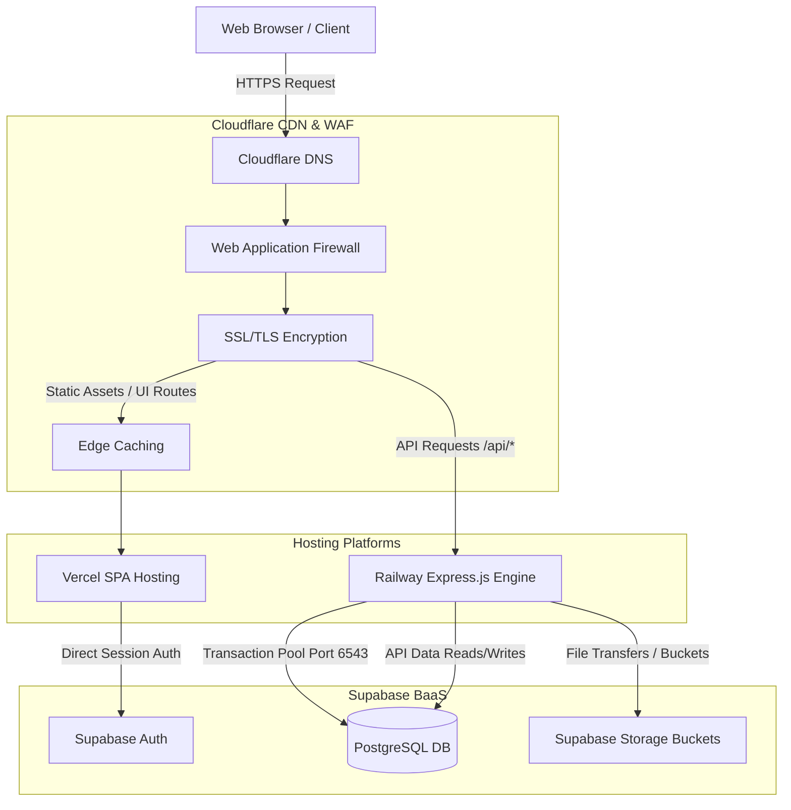

# Production Deployment Architecture

This document specifies the production deployment architecture, security layout, backup schedules, monitoring pipelines, Git flow, and CI/CD pipelines for the **Suyash Pride Portal**.

---

## 1. Infrastructure Architecture

The portal is designed for high availability, security, and low latency using a modern cloud architecture.



---

## 2. Cloudflare CDN & DNS Setup

Cloudflare acts as the edge gateway, providing DNS management, SSL certificates, Web Application Firewall (WAF) protections, and static assets caching.

### A. SSL/TLS Settings
- **Encryption Mode**: `Full (Strict)` (requires a valid certificate on Vercel and Railway endpoints).
- **Minimum TLS Version**: `TLS 1.2` (for modern security standards).
- **HSTS (HTTP Strict Transport Security)**: Enabled with 1-year duration, including subdomains and preloading.

### B. WAF Firewall Rules
- **Rate Limiting Rules**: Block IP addresses exceeding 60 requests per minute on auth endpoints (`/api/v1/auth/login`, `/api/v1/auth/register`).
- **Geoblocking**: Restrict write actions to the host nation (e.g., India) for administrative paths (`/api/v1/admin/*`, `/api/v1/superadmin/*`) to reduce brute force risks.
- **Threat Protection**: Enabled OWASP Core Rule Set (CRS) at `Medium` sensitivity.

### C. Page Rules / Cache Rules
- **Caching Rules**: Cache static assets under `/assets/*` with a Time-To-Live (TTL) of 30 days.
- **Bypass Caching**: Ensure all requests matching `/api/*` bypass Cloudflare cache completely to ensure real-time dynamic JSON responses.

---

## 3. Hosting Platforms Setup

### A. Frontend (Vercel SPA)
- **Deployment Source**: Connects to the `main` branch of the GitHub repository.
- **Framework Preset**: `Vite` (automatic output directory settings `dist`).
- **Single Page Application Rewrite Configuration (`vercel.json`)**:
  ```json
  {
    "rewrites": [
      {
        "source": "/(.*)",
        "destination": "/index.html"
      }
    ]
  }
  ```
- **Environment Variables**:
  - `VITE_API_URL`: `https://api.suyashpride.in/api/v1`

### B. Backend (Railway/Render Express.js)
- **Deployment Source**: Connects to the `main` branch (restricted to subfolder changes in `/server`).
- **Resource Constraints**:
  - **Memory Limit**: 512MB RAM.
  - **CPU Limit**: 0.5 vCPU.
- **Scaling Policy**: Horizontal scaling enabled (minimum 1 instance, maximum 3 instances based on CPU usage > 80%).
- **Healthcheck Endpoint**:
  - **Path**: `/api/health`
  - **Interval**: 30 seconds
  - **Timeout**: 5 seconds
- **Environment Variables**:
  - `NODE_ENV`: `production`
  - `PORT`: `PORT` (allocated dynamically by host)
  - `JWT_SECRET`: Secure cryptographic token (e.g. 64-byte hex value)
  - `SUPABASE_URL`, `SUPABASE_ANON_KEY`, `SUPABASE_SERVICE_ROLE_KEY`
  - `RAZORPAY_KEY_ID`, `RAZORPAY_KEY_SECRET`

---

## 4. Database & Storage (Supabase)

### A. Database Connection Pooling
- **Connection Model**: Because Serverless functions (or scaled Node.js instances) open multiple ephemeral connections, utilize the Supabase Connection Pooler:
  - **Transaction Mode Pooler (Port 6543)**: Default connection port for standard application queries to optimize connection limits.
  - **Session Mode Direct (Port 5432)**: Reserved for migration scripts or background cron tasks requiring long-lived sessions.

### B. Storage Buckets
- **Public Buckets**:
  - `gallery-assets`: Stores albums/images accessible to everyone. Read permission set to `true` globally.
  - `public-documents`: Stores blank application forms or NOC templates.
- **Private Buckets**:
  - `resident-documents`: Stores private documents (sales deeds, share certificates). Read permission restricted to the document owner (`user_id = auth.uid()`) or admins.

---

## 5. Monitoring & Alerting

### A. Error Tracking (Sentry)
- **Frontend Sentry SDK**: Configured inside `client/src/main.jsx` with an Error Boundary wrapper to catch runtime JS exceptions.
- **Backend Sentry SDK**: Mounted as the first middleware in `server/server.js` and the default error handler to capture 500 error logs.

### B. Logging (Grafana / Logtail)
- All Railway/Render server console outputs (`stdout` / `stderr`) are piped to a log aggregator (e.g. Logtail/Loki).
- Configured Slack alerts for `Error` level logs occurring more than 3 times in 5 minutes.

---

## 6. Backups & Disaster Recovery

### A. Backup Strategy
1. **Database Logical Backups**: Automated daily logical backups (`pg_dump`) executed at 02:00 AM UTC. Retained for 30 days.
2. **Database Physical Backups**: Managed by Supabase (continuous WAL archiving and daily snapshot restores).
3. **Storage Bucket Backups**: Weekly incremental sync of all storage files to a secondary cloud storage provider (managed via a serverless cron function).

### B. Disaster Recovery Plan
- **RTO (Recovery Time Objective)**: < 2 hours.
- **RPO (Recovery Point Objective)**: < 24 hours (maximum 24 hours of data loss from database backup interval).
- **Failover Routine**:
  1. Point DNS records to a custom maintenance page on Cloudflare if Vercel/Railway goes down.
  2. Restore the latest daily database snapshot (`02:00 AM` backup) to a backup Supabase project if the primary project experiences unrecoverable corruption.
  3. Swap the Supabase environment URL/Key parameters in Railway settings.
  4. Redeploy the server.
  5. Restore DNS routing.

---

## 7. Git & Environment Strategy

### A. Branch Mapping
```text
[Feature Branch] ---> [dev] ---> [staging] ---> [main]
                        |            |            |
                        v            v            v
                 (Development)   (Staging)   (Production)
```

1. **`dev` Branch**: Mapped to the development environment. Automatic deployments on merge.
2. **`staging` Branch**: Pre-production environment mirroring production. Code must be approved here before production deployment.
3. **`main` Branch**: Production code. Deploys to live endpoints.

### B. Environment Matrix
| Variable | Development (`.env`) | Staging | Production |
| :--- | :--- | :--- | :--- |
| `NODE_ENV` | `development` | `staging` | `production` |
| `API_URL` | `http://localhost:5000` | `https://staging-api.suyashpride.in` | `https://api.suyashpride.in` |
| `SSL Mode` | `Bypass` | `Flexible` | `Full (Strict)` |

---

## 8. CI/CD Pipelines (GitHub Actions)

We implement two separate workflows in `.github/workflows/` to build, test, and deploy both components independently.

### A. Frontend Pipeline (`.github/workflows/frontend-ci.yml`)
```yaml
name: Frontend CI/CD

on:
  push:
    branches: [ main, staging ]
    paths:
      - 'client/**'
      - '.github/workflows/frontend-ci.yml'
  pull_request:
    branches: [ main, staging ]
    paths:
      - 'client/**'

jobs:
  build-and-test:
    runs-on: ubuntu-latest
    steps:
      - name: Checkout Code
        uses: actions/checkout@v3

      - name: Setup Node.js
        uses: actions/setup-node@v3
        with:
          node-version: 18
          cache: 'npm'
          cache-dependency-path: 'client/package-lock.json'

      - name: Install Dependencies
        run: |
          cd client
          npm ci

      - name: Lint Code
        run: |
          cd client
          npm run lint --if-present

      - name: Run Build (Dry-Run)
        run: |
          cd client
          npm run build
        env:
          VITE_API_URL: https://mock-api.suyashpride.in/api/v1
```

### B. Backend Pipeline (`.github/workflows/backend-ci.yml`)
```yaml
name: Backend CI/CD

on:
  push:
    branches: [ main, staging ]
    paths:
      - 'server/**'
      - '.github/workflows/backend-ci.yml'
  pull_request:
    branches: [ main, staging ]
    paths:
      - 'server/**'

jobs:
  test-and-deploy:
    runs-on: ubuntu-latest
    steps:
      - name: Checkout Code
        uses: actions/checkout@v3

      - name: Setup Node.js
        uses: actions/setup-node@v3
        with:
          node-version: 18
          cache: 'npm'
          cache-dependency-path: 'server/package-lock.json'

      - name: Install Dependencies
        run: |
          cd server
          npm ci

      - name: Run Syntax & Unit Tests
        run: |
          cd server
          npm test --if-present
```
