# UI/UX Design System & Architecture Specification

This document defines the complete visual and interaction architecture for the **Suyash Pride Housing Society Ltd. Portal**. 

---

## 1. Design Tokens (Tailwind Config Reference)

We utilize a modern 4px spacing scale and a premium typography hierarchy to create a sleek, premium experience.

### A. Color Palette
- **Primary (Deep Navy Blue)**: `#0F2D52` (Backgrounds, headers, dominant actions. Suggests trust, safety, and official status).
- **Secondary (Royal Gold)**: `#D4AF37` (Highlights, active border lines, primary CTAs. Signifies prestige and premium quality).
- **Accent (Ice Slate)**: `#F5F7FA` (Neutral page background, card headers, disabled states).
- **Success (Green)**: `#22C55E` (Paid status, resolved complaints, approved residents).
- **Danger (Red)**: `#EF4444` (Overdue warnings, rejected tickets, delete indicators).
- **Neutral Texts**:
  - Primary text: `#1E293B` (Slate-800)
  - Secondary text: `#64748B` (Slate-500)
  - Borders: `#E2E8F0` (Slate-200)

### B. Typography (Google Fonts: Outfit & Inter)
- **Heading Font (Outfit)**: Used for page headers, card titles, and stats numbers.
  - `Display 1`: `3rem / 48px` (Font weight 800)
  - `Heading 1`: `2.25rem / 36px` (Font weight 700)
  - `Heading 2`: `1.5rem / 24px` (Font weight 600)
  - `Heading 3`: `1.125rem / 18px` (Font weight 600)
- **Body Font (Inter)**: Used for body texts, form labels, and table entries.
  - `Body Standard`: `0.875rem / 14px` (Font weight 400)
  - `Body Small`: `0.75rem / 12px` (Font weight 400)
  - `Button / Action Label`: `0.875rem / 14px` (Font weight 600)

### C. Spacing Scale (4px base grid)
- `space-1`: `4px` (Label to input gap)
- `space-2`: `8px` (Card inner elements padding)
- `space-3`: `12px` (Button inner horizontal padding)
- `space-4`: `16px` (Grid margins, small card paddings)
- `space-6`: `24px` (Standard page inner margins)
- `space-8`: `32px` (Section gaps, dashboard widget gaps)

---

## 2. Component Library Hierarchy

All views are assembled using reusable, atomic UI components.

```text
Root Application Container
 ├── Layout Framework (Public, Resident, Admin, SuperAdmin)
 │    ├── Navbar / Header (App branding, profile dropdown, notifications bell)
 │    ├── Sidebar Nav (Contextual links, collapsible, mobile bottom nav)
 │    └── Footer (Copyrights, Ulwe office address, map shortcuts)
 └── Page Views
      ├── PageHeader (Breadcrumbs, title, subtitle, CTA button)
      ├── SearchBar (Input field, category filters dropdown)
      ├── DataTable (Reusable table, page size selector, sort headers)
      ├── NoticeCard / EventCard / ComplaintCard / PaymentCard (Grid card wrappers)
      ├── MapWidget (Leaflet leaflet map iframe wrapper container)
      └── ChatbotWidget (Collapsible overlay queries responder)
```

---

## 3. Wireframe Layout Diagrams (ASCII Templates)

### A. Public Landing Page Wireframe (Desktop)
```text
+-----------------------------------------------------------------------------+
| [SUYASH PRIDE]                   Home  About  Notices  Downloads    [Login] |
+-----------------------------------------------------------------------------+
|                                                                             |
|      =================== WELCOME TO SUYASH PRIDE ===================        |
|      Modern living, integrated facilities, and a secure community           |
|      Location: Plot-1, Sector-5, Ulwe Node, Navi Mumbai.                    |
|                                                                             |
|                     [Access Member Portal]  [Learn More]                    |
|                                                                             |
+-----------------------------------------------------------------------------+
|   [📢 Society Notices]        |   [📅 Social Events]    |   [📍 Maps Widget]  |
|  * Water Tank Clean (15-Jun)  |  * Tree Plantation Drive|  Coordinate Pointer |
|  * Security App Launch        |  * Independence Day AGM |  Ulwe Node, Raigad  |
|                               |                         |                     |
|  [View All Notice List]       |  [View Events Calendar] |  [Open OSM Route]   |
+-----------------------------------------------------------------------------+
| Office: Saturday - Sunday (10AM - 1PM) | Contact: contact@suyashpride.in    |
+-----------------------------------------------------------------------------+
```

### B. Resident Portal Dashboard Wireframe
```text
+-----------------------------------------------------------------------------+
| [RESIDENT HUB] A-102 | Parth Patel                 [🔔 Notifications] [Logout] |
+-----------------------------------------------------------------------------+
| Dashboard |                                                                 |
| Profile   |  +-------------------+ +-------------------+ +---------------+  |
| Bills     |  | Pending Dues      | | Complaints Active | | Notice Feed   |  |
| Tickets   |  | ₹3,500            | | 1 (In Progress)   | | 2 New Pinned  |  |
| Documents |  | [Pay Razorpay]    | | [Track Tickets]   | | [Read circular|  |
| Chatbot   |  +-------------------+ +-------------------+ +---------------+  |
| Settings  |                                                                 |
|           |  +-----------------------------------------------------------+  |
|           |  | Recent Billing Transactions Ledger                        |  |
|           |  | Month       Amount     Due Date      Status     Action    |  |
|           |  | June 2026   ₹3,500     15-Jun-2026   PENDING    [Pay Now] |  |
|           |  | May 2026    ₹3,500     15-May-2026   PAID       [Receipt] |  |
|           |  +-----------------------------------------------------------+  |
+-----------+-----------------------------------------------------------------+
```

---

## 4. Responsive Layout Rules

The portal enforces responsive grid properties using CSS flex/grid layout tokens:

### A. Desktop Width (`>= 1024px`)
- **Grid Layout**: 12 Columns.
- **Sidebar**: Sticky persistent left panel (`width: 16rem`).
- **Paddings**: Page container uses `px-8 py-8`.
- **Modals**: Fixed max-width overlays (`max-w-lg`) with backdrop blur filters.

### B. Tablet Width (`768px <= width < 1024px`)
- **Grid Layout**: 8 Columns.
- **Sidebar**: Sliding side drawer toggled by hamburger menu icon.
- **Paddings**: Page container uses `px-6 py-6`.
- **Data Tables**: Enable horizontal scroll fallback container.

### C. Mobile Width (`< 768px`)
- **Grid Layout**: 4 Columns.
- **Sidebar**: Replaced by bottom navigation drawer bar with 5 shortcuts (Home, Bills, Tickets, Assistant, Settings).
- **Paddings**: Page container uses `px-4 py-4`.
- **Cards**: Single-column vertical stacking. Tables collapse into card widget blocks.

---

## 5. Navigation Flow Chart

```mermaid
graph TD
    %% Public Entry
    Guest[Public Visitor] -->|Browse| Landing[Home Landing Page]
    Landing --> About[About Society]
    Landing --> PublicNotices[Notices List]
    Landing --> PublicDownloads[Downloads Directory]
    Landing --> Contact[Contact & Map Page]
    Landing --> SignIn[Sign In Page]
    
    %% Sign In routing
    SignIn -->|Resident Role| ResDashboard[Resident Dashboard]
    SignIn -->|Committee Role| AdminDashboard[Admin Dashboard]
    SignIn -->|SuperAdmin Role| SADashboard[SuperAdmin Dashboard]
    
    %% Resident Sub-Pages
    subgraph Resident Area
    ResDashboard --> ResProfile[Profile & Vehicles]
    ResDashboard --> ResBills[Bills & Pay Now]
    ResDashboard --> ResComplaints[Filing Complaint Tickets]
    ResDashboard --> ResDocs[Private Registry Documents]
    ResDashboard --> ResChat[AI Chatbot Widget]
    end
    
    %% Admin Sub-Pages
    subgraph Committee Area
    AdminDashboard --> ManageNotices[Notice Management]
    AdminDashboard --> ManageDocs[Document Center]
    AdminDashboard --> ManageEvents[Events Management]
    AdminDashboard --> ManageComplaints[Helpdesk Review]
    AdminDashboard --> ManageResidents[Residents Directory Verification]
    AdminDashboard --> ManagePayments[Cheque Payments Record]
    end
    
    %% SuperAdmin Sub-Pages
    subgraph Root Developer Area
    SADashboard --> UserAccounts[User Management]
    SADashboard --> RoleAccess[Role Authority Editor]
    SADashboard --> StorageQuotas[Storage Buckets Audit]
    SADashboard --> SystemLogs[System Audit Logs]
    end
```



---

## 6. Accessibility & WCAG 2.1 Standards Checklist

To ensure all society residents (including elderly members) can easily operate the portal:

1. **Color Contrast**:
   - Ensure a minimum contrast ratio of `4.5:1` for all body text against backgrounds, and `3:1` for large heading titles (complying with WCAG 2.1 Level AA).
2. **Keyboard Navigation**:
   - Focus outline rings must be clearly visible (`focus:ring-2 focus:ring-[#D4AF37] focus:outline-none`) when navigating via Tab key.
   - Modals must catch keyboard focus and close instantly when pressing `Escape` key.
3. **Screen Readers (Semantic Markup)**:
   - All text inputs must have explicitly paired `<label>` tags.
   - Decorative images must have `alt=""` attributes. Actionable images must describe targets (e.g. `alt="Download PDF Receipt"`).
   - Use correct landmarks (`<header>`, `<nav>`, `<main>`, `<aside>`, `<footer>`).
4. **Action Target Sizes**:
   - Ensure touch targets on mobile/tablet (buttons, icons) have a minimum dimension of `44px x 44px`.
