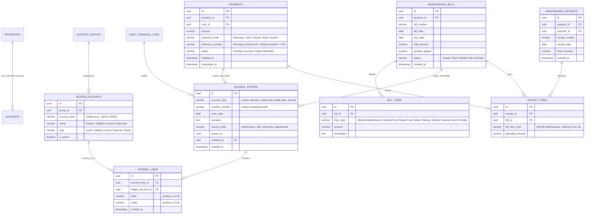

# Financial & Accounting Architecture Specification
**Suyash Pride Housing Society Ltd. Portal**

This document specifies the end-to-end financial system design, accounting models, double-entry ledger schemas, payment workflows, and reporting architectures for **Suyash Pride Housing Society Ltd.** (137 total billable units: 112 residential flats, 25 commercial shops).

---

## 1. Accounting & Financial Model Overview

Housing society accounting operates under the **Cooperative Housing Society (CHS) Rules** and standard accrual accounting principles. To ensure compliance, transparency, and auditability:
* **Accrual Basis**: Income (Maintenance dues) is recognized when billed (invoiced), and expenses are recognized when incurred.
* **Double-Entry Ledger**: Every financial transaction must affect at least two accounts (debit and credit) with equal and opposing entries.
* **Fund Accounting**: Specific collections (e.g. Sinking Fund, Repair Fund) are earmarked and must be held in dedicated liability/equity reserve accounts and spent strictly on their designated purposes.

---

## 2. Entity Relationship Diagram (ERD)

The following Mermaid diagram maps the financial tables, ledger accounts, and transaction flows:



---

## 3. Database Table Specifications

### A. Chart of Accounts Setup (`ledger_accounts` & `account_groups`)
To isolate financial streams, we structure accounts hierarchically.

```sql
-- Account Groups Table
CREATE TABLE account_groups (
    id UUID PRIMARY KEY DEFAULT gen_random_uuid(),
    code VARCHAR(50) UNIQUE NOT NULL,
    name VARCHAR(100) NOT NULL,
    parent_id UUID REFERENCES account_groups(id)
);

-- Ledger Accounts Table
CREATE TABLE ledger_accounts (
    id UUID PRIMARY KEY DEFAULT gen_random_uuid(),
    group_id UUID REFERENCES account_groups(id) NOT NULL,
    account_code VARCHAR(50) UNIQUE NOT NULL,
    name VARCHAR(150) NOT NULL,
    type VARCHAR(50) NOT NULL CHECK (type IN ('Asset', 'Liability', 'Income', 'Expense', 'Equity')),
    description TEXT,
    is_active BOOLEAN DEFAULT TRUE NOT NULL,
    created_at TIMESTAMP WITH TIME ZONE DEFAULT NOW() NOT NULL
);
```

#### Core Chart of Accounts (CoA) Seeds:
1. **1000 - Assets**
   - `1001`: Cash on Hand
   - `1002`: Union Bank of India (Main A/c)
   - `1003`: Union Bank of India (Sinking Fund Reserve A/c)
   - `1004`: Accounts Receivable (Residents)
   - `1005`: Accounts Receivable (Commercial Shops)
2. **2000 - Liabilities & Reserves (Funds)**
   - `2001`: Sinking Fund Reserve (Equity/Reserve)
   - `2002`: Repair Fund Reserve (Equity/Reserve)
   - `2003`: Special Assessment Reserve
   - `2004`: Festival Fund Liabilities
   - `2005`: Advance Maintenance Deposits (Overpayments)
3. **3000 - Income**
   - `3001`: Monthly Maintenance Charges (Residential)
   - `3002`: Monthly Maintenance Charges (Commercial)
   - `3003`: Water Charges Collected
   - `3004`: Parking Space Charges
   - `3005`: Non-Occupancy Charges (applicable on let-out properties)
   - `3006`: Late Payment Penalty Interest
   - `3007`: Cultural/Festival Contributions
   - `3008`: Clubhouse/Event Space Rental Fees
4. **4000 - Expenses**
   - `4001`: Electricity Charges (Water pumps, lift, common lights)
   - `4002`: Security Service AMC
   - `4003`: Lift AMC & Service
   - `4004`: Housekeeping & Cleaning AMG
   - `4005`: Water Tank Cleaning & Tanker Purchases
   - `4006`: Repair & Maintenance (Common areas)
   - `4007`: Conveyance & Audit Fees

---

### B. Billing & Invoicing Schemas (`maintenance_bills` & `bill_items`)
Every month, the system auto-generates bills for the 137 properties based on unit square footage or fixed rates.

```sql
CREATE TABLE maintenance_bills (
    id UUID PRIMARY KEY DEFAULT gen_random_uuid(),
    property_id UUID REFERENCES properties(id) ON DELETE RESTRICT NOT NULL,
    bill_number VARCHAR(100) UNIQUE NOT NULL, -- Format: SP-2026-06-A102
    bill_date DATE NOT NULL,
    due_date DATE NOT NULL,
    total_amount NUMERIC(12, 2) NOT NULL CHECK (total_amount >= 0),
    penalty_applied NUMERIC(12, 2) DEFAULT 0.00 NOT NULL CHECK (penalty_applied >= 0),
    status VARCHAR(50) DEFAULT 'Unpaid' NOT NULL CHECK (status IN ('Unpaid', 'Paid', 'Partially Paid', 'Overdue')),
    notes TEXT,
    created_at TIMESTAMP WITH TIME ZONE DEFAULT NOW() NOT NULL,
    updated_at TIMESTAMP WITH TIME ZONE DEFAULT NOW() NOT NULL
);

CREATE TABLE bill_items (
    id UUID PRIMARY KEY DEFAULT gen_random_uuid(),
    bill_id UUID REFERENCES maintenance_bills(id) ON DELETE CASCADE NOT NULL,
    item_type VARCHAR(100) NOT NULL CHECK (item_type IN ('Monthly Maintenance', 'Sinking Fund', 'Repair Fund', 'Water Charges', 'Parking Charges', 'Interest/Penalty', 'Special Assessment', 'Festival Contributions', 'Event Fees')),
    amount NUMERIC(12, 2) NOT NULL CHECK (amount >= 0),
    description TEXT,
    created_at TIMESTAMP WITH TIME ZONE DEFAULT NOW() NOT NULL
);

CREATE INDEX idx_bills_property ON maintenance_bills(property_id);
CREATE INDEX idx_bills_status ON maintenance_bills(status);
```

---

### C. Double-Entry Journal Books (`journal_entries` & `journal_lines`)
Every transaction is posted to the ledger journal. These tables are **read-only** and **append-only** to satisfy audit requirements.

```sql
CREATE TABLE journal_entries (
    id UUID PRIMARY KEY DEFAULT gen_random_uuid(),
    voucher_type VARCHAR(50) NOT NULL CHECK (voucher_type IN ('Invoice', 'Receipt', 'Credit Note', 'Debit Note', 'Journal')),
    voucher_number VARCHAR(100) UNIQUE NOT NULL, -- e.g., INV-00431, RCPT-00984
    entry_date DATE NOT NULL,
    narration TEXT NOT NULL,
    source_entity VARCHAR(100) NOT NULL, -- 'maintenance_bills', 'payments', etc.
    source_id UUID NOT NULL, -- ID of the source transaction
    created_by UUID REFERENCES users(id) ON DELETE SET NULL,
    created_at TIMESTAMP WITH TIME ZONE DEFAULT NOW() NOT NULL
);

CREATE TABLE journal_lines (
    id UUID PRIMARY KEY DEFAULT gen_random_uuid(),
    journal_entry_id UUID REFERENCES journal_entries(id) ON DELETE CASCADE NOT NULL,
    ledger_account_id UUID REFERENCES ledger_accounts(id) ON DELETE RESTRICT NOT NULL,
    debit NUMERIC(12, 2) DEFAULT 0.00 NOT NULL CHECK (debit >= 0.00),
    credit NUMERIC(12, 2) DEFAULT 0.00 NOT NULL CHECK (credit >= 0.00),
    created_at TIMESTAMP WITH TIME ZONE DEFAULT NOW() NOT NULL,
    CONSTRAINT check_line_values CHECK ((debit > 0 AND credit = 0) OR (debit = 0 AND credit > 0))
);

CREATE INDEX idx_lines_account ON journal_lines(ledger_account_id);
CREATE INDEX idx_lines_entry ON journal_lines(journal_entry_id);
```

#### Journal Integrity Constraints (Database Level Trigger):
A constraint trigger enforces that for every `journal_entry_id`, the sum of debits equals the sum of credits before committing.
```sql
CREATE OR REPLACE FUNCTION verify_journal_double_entry()
RETURNS TRIGGER AS $$
DECLARE
    sum_debits NUMERIC(12, 2);
    sum_credits NUMERIC(12, 2);
BEGIN
    SELECT COALESCE(SUM(debit), 0.00), COALESCE(SUM(credit), 0.00)
    INTO sum_debits, sum_credits
    FROM journal_lines
    WHERE journal_entry_id = NEW.journal_entry_id;

    IF sum_debits <> sum_credits THEN
        RAISE EXCEPTION 'Journal entry unbalanced! Total Debits (%) must equal Total Credits (%).', sum_debits, sum_credits;
    END IF;
    RETURN NEW;
END;
$$ LANGUAGE plpgsql;
```

---

### D. Payments & Receipts Schemas (`payments`, `maintenance_receipts`, & `receipt_items`)
Triggers payment capturing and allocation down to specific bill items.

```sql
CREATE TABLE payments (
    id UUID PRIMARY KEY DEFAULT gen_random_uuid(),
    property_id UUID REFERENCES properties(id) ON DELETE RESTRICT NOT NULL,
    user_id UUID REFERENCES users(id) ON DELETE SET NULL NOT NULL, -- Who paid
    amount NUMERIC(12, 2) NOT NULL CHECK (amount > 0),
    payment_mode VARCHAR(50) NOT NULL CHECK (payment_mode IN ('Razorpay', 'Cash', 'Cheque', 'Bank Transfer')),
    reference_number VARCHAR(150), -- Razorpay Pay ID, Cheque No, Bank UTR
    status VARCHAR(50) DEFAULT 'Pending' NOT NULL CHECK (status IN ('Pending', 'Success', 'Failed', 'Refunded')),
    details JSONB, -- Additional details (Bank name, Cheque date, Razorpay order meta)
    initiated_at TIMESTAMP WITH TIME ZONE DEFAULT NOW() NOT NULL,
    completed_at TIMESTAMP WITH TIME ZONE
);

CREATE TABLE maintenance_receipts (
    id UUID PRIMARY KEY DEFAULT gen_random_uuid(),
    property_id UUID REFERENCES properties(id) ON DELETE RESTRICT NOT NULL,
    payment_id UUID REFERENCES payments(id) ON DELETE RESTRICT NOT NULL,
    receipt_number VARCHAR(100) UNIQUE NOT NULL, -- RCPT-2026-XXXX
    receipt_date DATE NOT NULL,
    total_received NUMERIC(12, 2) NOT NULL CHECK (total_received > 0),
    created_at TIMESTAMP WITH TIME ZONE DEFAULT NOW() NOT NULL
);

CREATE TABLE receipt_items (
    id UUID PRIMARY KEY DEFAULT gen_random_uuid(),
    receipt_id UUID REFERENCES maintenance_receipts(id) ON DELETE CASCADE NOT NULL,
    bill_id UUID REFERENCES maintenance_bills(id) ON DELETE RESTRICT NOT NULL,
    item_type VARCHAR(100) NOT NULL CHECK (item_type IN ('Monthly Maintenance', 'Sinking Fund', 'Repair Fund', 'Water Charges', 'Parking Charges', 'Interest/Penalty', 'Special Assessment', 'Festival Contributions', 'Event Fees')),
    allocated_amount NUMERIC(12, 2) NOT NULL CHECK (allocated_amount >= 0)
);
```

---

## 4. Key Accounting & Payment Workflows

### A. Accrual Billing (Monthly Invoicing Flow)
When the society committee issues the monthly invoice (bill) for a flat (e.g. A-102, due INR 3,500):
1. Create a `maintenance_bills` record and associated `bill_items`.
2. Post a `journal_entries` record of type `'Invoice'`.
3. Post `journal_lines` detailing the ledger impact:

| Account Code | Account Name | Debit (Dr) | Credit (Cr) | Action Type |
| :--- | :--- | :---: | :---: | :--- |
| `1004` | Accounts Receivable (Residents) | INR 3,500.00 | | Asset (Debit increases) |
| `3001` | Monthly Maintenance Income | | INR 2,000.00 | Income (Credit increases) |
| `2001` | Sinking Fund Reserve | | INR 500.00 | Liability Reserve Fund |
| `2002` | Repair Fund Reserve | | INR 500.00 | Liability Reserve Fund |
| `3003` | Water Charges Collected | | INR 500.00 | Income (Credit increases) |

---

### B. Payment Capture & Auto-Allocation Flow
When a resident makes a payment of INR 3,500 via UPI (Razorpay):
1. **Initiate Payment**: Insert pending `payments` record, trigger Razorpay order.
2. **Callback / Verification**: Verify payment signature on signature verification endpoint.
3. **Receipt Generation**:
   - Status updated to `'Success'`.
   - Update `maintenance_bills` status to `'Paid'`.
   - Generate `maintenance_receipts` record.
   - Insert records into `receipt_items` mapping allocations.
4. **Double-Entry Posting**: Post a `journal_entries` record of type `'Receipt'`:

| Account Code | Account Name | Debit (Dr) | Credit (Cr) | Action Type |
| :--- | :--- | :---: | :---: | :--- |
| `1002` | Union Bank of India (Main A/c) | INR 3,500.00 | | Asset (Dr increases) |
| `1004` | Accounts Receivable (Residents) | | INR 3,500.00 | Asset (Cr decreases) |

5. **Fund Transfer Postings (Earmarking)**:
   Since Sinking and Repair Funds were collected, the cash corresponding to those amounts must be moved to the Sinking Fund bank account:

| Account Code | Account Name | Debit (Dr) | Credit (Cr) | Action Type |
| :--- | :--- | :---: | :---: | :--- |
| `1003` | Bank A/c (Sinking Fund Reserve) | INR 1,000.00 | | Bank Reserve Transfer |
| `1002` | Union Bank of India (Main A/c) | | INR 1,000.00 | Main Account Sweep |

---

### C. Overpayment / Advance Maintenance Flow
If a resident pays INR 5,000 instead of their due INR 3,500:
* The system automatically allocates INR 3,500 to pay off the active bill.
* The remaining INR 1,500 is credited to the Resident's **Advance Maintenance Deposit** liability account.

**Ledger posting for receipt of INR 5,000 (INR 3,500 bill + INR 1,500 advance):**

| Account Code | Account Name | Debit (Dr) | Credit (Cr) | Action Type |
| :--- | :--- | :---: | :---: | :--- |
| `1002` | Union Bank of India (Main A/c) | INR 5,000.00 | | Cash Received |
| `1004` | Accounts Receivable (Residents) | | INR 3,500.00 | Receivable cleared |
| `2005` | Advance Maintenance Deposits | | INR 1,500.00 | Liability (Unearned revenue) |

When the next month's bill is generated (INR 3,500):
* The system checks the advance ledger.
* Deducts INR 1,500 from `2005` (Debit) and credits `1004` (Accounts Receivable), marking the new bill as Partially Paid (remaining due: INR 2,000).

---

## 5. Bank Reconciliation (Reconciliation Flow)

Reconciliation matches external Bank Statements (PDF/Excel uploads) with internal Cash/Bank ledger books (`1002`/`1003` accounts).

```
[ Upload Bank Statement (CSV/Excel) ]
                 │
                 ▼
[ Match Rule Engine ] ──► (Match by UTR, Transaction ID, Date, and Exact Amount)
                 │
      ┌──────────┴──────────┐
      ▼                     ▼
[ Auto-Matched ]     [ Unmatched Queue ] (Requires manual mapping / Adjustments)
      │                     │
      ▼                     ▼
[ Reconciled Entry ]  [ Credit Note / Debit Note / Suspense Ledger Posting ]
```

### Reconciliation Table:
```sql
CREATE TABLE bank_statement_records (
    id UUID PRIMARY KEY DEFAULT gen_random_uuid(),
    transaction_date DATE NOT NULL,
    value_date DATE NOT NULL,
    description VARCHAR(255) NOT NULL,
    reference_number VARCHAR(150), -- UTR or Bank Ref
    debit_amount NUMERIC(12, 2) DEFAULT 0.00 NOT NULL,
    credit_amount NUMERIC(12, 2) DEFAULT 0.00 NOT NULL,
    balance NUMERIC(12, 2) NOT NULL,
    is_matched BOOLEAN DEFAULT FALSE NOT NULL,
    matched_journal_id UUID REFERENCES journal_entries(id)
);
```

---

## 6. Financial Reports Design

We define standard database queries to generate core reports:

### A. Resident & Shop Ledgers (Statements of Account)
Shows all transactions, invoice charges, payments made, and running balances for a specific flat.
* **SQL Query Pattern**:
  ```sql
  SELECT 
      je.entry_date,
      je.voucher_type,
      je.voucher_number,
      je.narration,
      jl.debit,
      jl.credit,
      SUM(jl.debit - jl.credit) OVER (ORDER BY je.entry_date, je.created_at) as running_balance
  FROM journal_entries je
  JOIN journal_lines jl ON jl.journal_entry_id = je.id
  WHERE jl.ledger_account_id = (
      -- Resolve Resident's specific Accounts Receivable ledger ID
  )
  ORDER BY je.entry_date, je.created_at;
  ```

### B. Outstanding & Defaulter Reports
Lists properties with unpaid dues, categorized by aging bracket (0-30 days, 31-60 days, 61-90 days, 90+ days).
* **Defaulter Policy**: Standard housing society rules apply: > 3 months of unpaid dues flags the unit as a "Defaulter", triggering interest penalty calculations (e.g. 15% per annum on unpaid principal).

### C. Fund-wise Collection Report
Shows exactly how much Sinking Fund, Repair Fund, and general maintenance has been collected during a specific date range, ensuring cash-backing matching.

---

## 7. Financial Auditing & Security

1. **Immutability Constraint**: `journal_lines` and `journal_entries` cannot be edited (`UPDATE`) or deleted (`DELETE`) once posted.
   ```sql
   CREATE OR REPLACE FUNCTION lock_journal_tables()
   RETURNS TRIGGER AS $$
   BEGIN
       RAISE EXCEPTION 'Posted journal records are immutable. Adjustments must be recorded via Debit/Credit notes.';
   END;
   $$ LANGUAGE plpgsql;

   CREATE TRIGGER trg_lock_journal_lines
   BEFORE UPDATE OR DELETE ON journal_lines
   FOR EACH ROW EXECUTE FUNCTION lock_journal_tables();
   ```
2. **Detailed System Log Logging**: All triggers log creations, metadata, and IP references to the central `audit_logs` database table.
